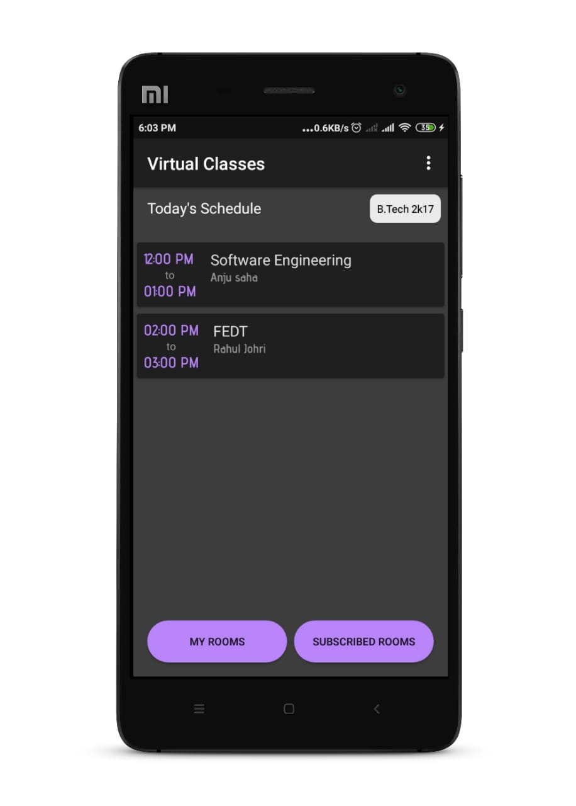
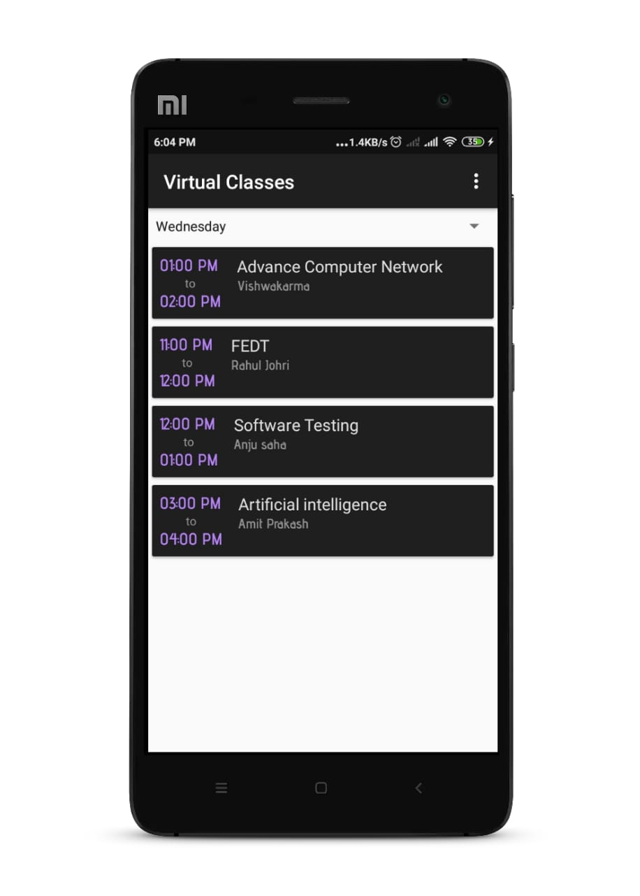

# Virtual Classes Schedule
This is an app for getting up to date with the latest college/university classes schedule.   [Apk Link](https://drive.google.com/file/d/1bwbWYk9JN0bs_N5QVTgadG_3THRGWTts/view?usp=sharing)

# Imagine this problem Scenerio
During this covid-19 pandemic all the classes are being taken online and these classes re-schedule a lot due to which many time we just don't remember when the classes are being taken
and we miss those classes.
Now Imagine, 
You have a class today at 9:00 in the morning but the teacher has re-scheduled it to tommorow at 11:00 AM. Everything is fine till now but suppose you also have a class tommorow at 10:00AM which also get re-sheduled to day after tommorrow
and imagine this happening with two more reschedule, this will be hard to track which is class scheduled at what day and time. Class Representative just whatsapp the class re-schedule
information on whatsapp, now it is easy to miss the class.
# What problem does this app solve?
This app solve the above problem by maintaining all the classes schedule.
How?
Instead of sending class re-schedule message to whatsapp group CR just need to update the schedule in the respective room in the app and all the students in subscribed to that room will get the notification about the class re-schedule.
Plus you just to need to look at the app in the morning and app will show you the 'Today's schedule'. 
Problem Solve :)

# ScreenShots
       
